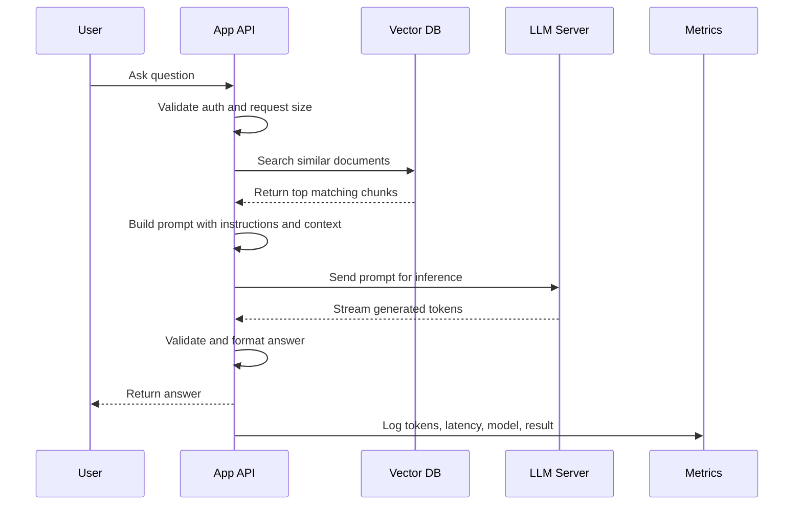
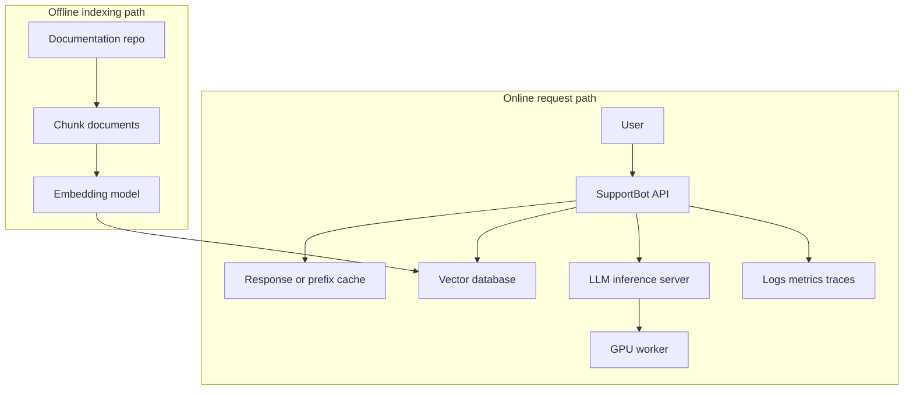
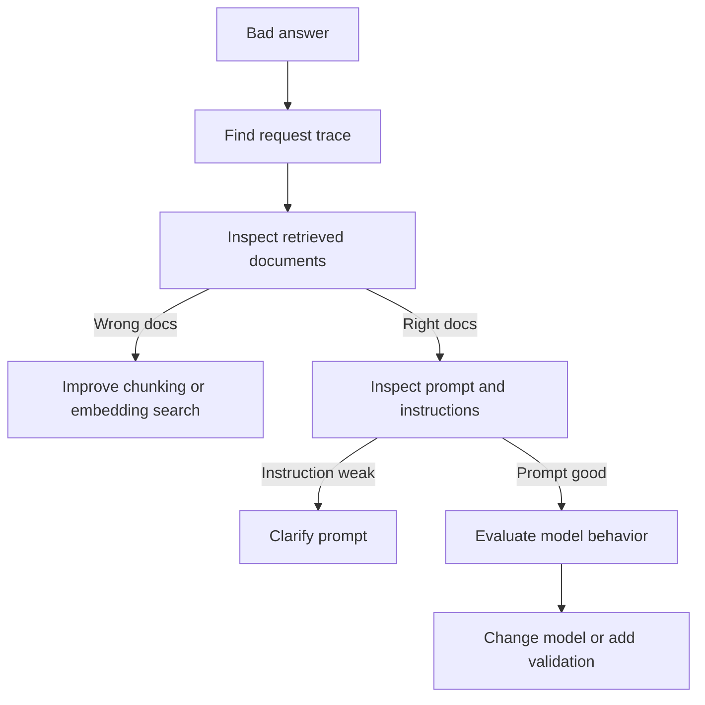

# End-To-End Case Study: Building SupportBot

This case study connects the chapters into one realistic system.

SupportBot answers customer questions from company documentation. The first version does not train a new model. It uses inference with a general LLM, an embedding model, a vector database, and a production API.

## Product Requirement

A user should be able to ask:

```text
How do I rotate an API key?
```

SupportBot should answer using company documentation, not guess from memory.

The answer should:

- Be returned in less than a few seconds for normal questions.
- Cite or reference the source document when possible.
- Refuse when the answer is not in the documents.
- Avoid exposing private internal notes.
- Be measurable for latency, cost, and quality.

## System Flow



## Minimal Prompt Shape

```text
System:
You are SupportBot. Answer only from the provided documentation.
If the documentation does not contain the answer, say you do not know.

User question:
How do I rotate an API key?

Relevant documentation:
1. API keys can be rotated from Settings > Security > API Keys.
2. After creating a new key, update your application secret store.
3. Revoke the old key only after traffic has moved to the new key.

Answer:
```

This prompt gives the model a job, a rule, the user's question, and the evidence it should use.

## Request Budget Example

| Item | Example Value | Why It Matters |
| --- | ---: | --- |
| User question | 15 tokens | Usually small |
| System instruction | 60 tokens | Repeated on every request |
| Retrieved context | 1,200 tokens | Often the largest input cost |
| Expected answer | 200 tokens | Controls decode time |
| Total | 1,475 tokens | Drives latency and cost |

The retrieved context dominates this request. If retrieval returns too much text, prefill latency and cost increase.

## First Production Architecture



There are two paths. The offline path prepares searchable documents. The online path answers user questions.

## What To Measure First

| Metric | Good Question |
| --- | --- |
| Time to first token | How long before the user sees output? |
| Total latency | How long until the final answer? |
| Input tokens | Are we sending too much context? |
| Output tokens | Are answers too verbose? |
| Retrieval hit rate | Did search find the right document? |
| Refusal rate | Is the bot refusing too often or too little? |
| Cost per answer | Can this run under expected traffic? |
| Human rating | Did the answer actually help? |

## Failure Example

Problem:

```text
Users report that SupportBot gives outdated billing answers.
```

Investigation flow:



This is an important habit: do not immediately blame the model. In many AI systems, bad answers come from bad retrieval, bad prompt construction, stale documents, or missing validation.

## Practical Build Order

1. Build a simple API that accepts a question.
2. Add an embedding model and vector search over a small document set.
3. Build a prompt from the top retrieved chunks.
4. Call an LLM and stream the answer.
5. Add token counting and latency metrics.
6. Add source references.
7. Add refusal behavior when retrieval is weak.
8. Add evaluation examples.
9. Add caching and rate limits.
10. Deploy with canary rollout and monitoring.

## What Good Looks Like

SupportBot is production-ready only when the team can answer these questions:

- What happens when retrieval finds no useful documents?
- What happens when the model returns invalid output?
- What is the p95 latency during peak traffic?
- How much does one successful answer cost?
- Which model and prompt version produced an answer?
- Can the team roll back a bad model deployment quickly?
- Are sensitive prompts and outputs protected in logs?

Inference engineering is the work required to make those answers concrete.
