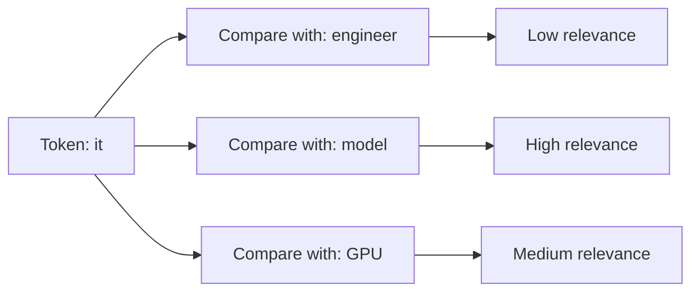
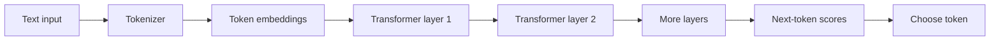

# 05. Transformers

Transformers are the model architecture behind most modern large language models.

A transformer is useful because it can process a sequence of tokens and learn relationships between them. In a language model, those tokens are pieces of text. In a vision-language model, some tokens may represent image patches. The same basic architecture can be adapted to many input types.

## The Problem Transformers Solve

Language depends on context. A word near the end of a sentence may depend on a word near the beginning.

Consider this sentence:

```text
The engineer moved the model to a larger GPU because it was running out of memory.
```

What was running out of memory? The model, not the engineer and not the GPU. A useful language model must connect "it" back to the right earlier idea.

Transformers solve this with **attention**.

## Attention In Plain Language

Attention lets each token ask: "Which other tokens in this context matter for understanding me?"

The model does not literally understand English grammar like a person. It performs numerical comparisons between token representations. But the practical effect is that a token can use information from other tokens.



This happens across many layers and many attention heads. Each layer refines the representation.

## A Developer-Friendly Mental Model

Think of a transformer as a pipeline:



The model converts tokens into vectors, repeatedly updates those vectors using attention and feed-forward layers, then produces scores for the next token.

## Why Context Length Matters

The context is everything the model can see for the current request. It can include system messages, user messages, retrieved documents, tool outputs, and generated tokens.

Longer context usually means:

- More work during prefill
- More memory used by KV cache
- Higher cost
- More chances that irrelevant text distracts the model

More context is not automatically better. Useful context helps. Unused context wastes compute.

## Running Example: SupportBot

SupportBot receives this user question:

```text
Can I rotate an API key without downtime?
```

The application retrieves three documentation chunks and puts them into the prompt. The transformer sees both the question and the chunks in the same context.

Good context:

```text
API keys can be rotated by creating a new key, updating the application secret,
confirming traffic uses the new key, and then revoking the old key.
```

Bad context:

```text
Billing invoices can be downloaded from the account page.
```

The transformer can only reason over what was sent. If retrieval sends the wrong document, the model may answer badly even if the model itself is strong.

## Common Mistakes

- Sending too much chat history because it feels safer.
- Assuming the model remembers something from a previous request.
- Mixing important instructions with a large amount of irrelevant text.
- Changing model context length without measuring latency and memory.

## Key Ideas

- Transformers are the architecture behind many LLMs.
- Attention lets tokens use information from other tokens.
- Context is the information visible to the model during a request.
- Longer context increases cost and can reduce focus if it contains noise.

## Developer Checklist

- Count tokens, not only characters.
- Keep prompts as short as the task allows.
- Put important instructions clearly in context.
- Test retrieval quality before blaming the model.
- Measure latency at realistic context lengths.
