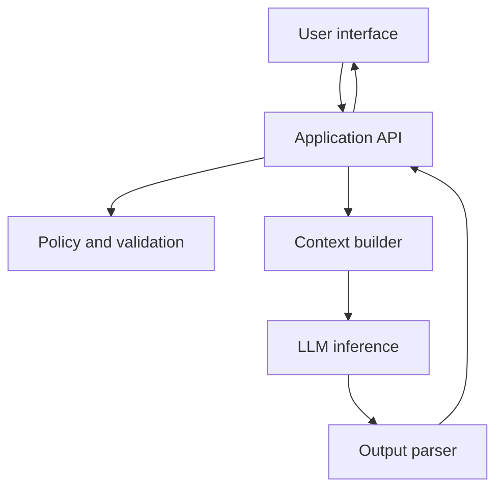

# 06. Large Language Models

A large language model, or LLM, is a model trained to process and generate text.

An LLM receives text as input and predicts text as output. It can answer questions, summarize documents, write code, classify text, extract data, and follow instructions.

## What "Generate Text" Really Means

An LLM does not write a complete paragraph in one operation. It predicts one token, adds that token to the sequence, and then predicts the next token.


This is why output length matters. A 20-token answer is cheaper and faster than a 2,000-token answer.

## Example

Prompt:

```text
Explain inference engineering in one sentence.
```

Possible generation:

```text
Inference engineering is the work of serving trained AI models quickly, reliably, and cost-effectively.
```

The model produced that sentence token by token. The application may stream each token to the user as it arrives.

## What LLMs Are Good At

LLMs are useful when the task can be expressed in language and the answer can be judged from context.

Good fits:

- Summarizing a support ticket
- Extracting fields from a document
- Drafting a response
- Explaining code
- Classifying user intent
- Rewriting text in a different tone

Poor fits without extra system design:

- Returning guaranteed correct financial calculations
- Making legal or medical decisions alone
- Remembering facts not included in context
- Enforcing permissions without application checks

## LLMs In A Real Application

An LLM is usually one component in a larger system.



The application still owns authentication, authorization, validation, storage, retries, and business rules.

## Running Example: SupportBot

SupportBot should not answer from vague memory. It should answer from provided documentation.

Weak design:

```text
User asks a question -> send directly to LLM -> return answer
```

Better design:

```text
User asks a question -> retrieve relevant docs -> build grounded prompt -> call LLM -> validate answer -> return with source
```

The second design uses the LLM for language reasoning while the application controls evidence and policy.

## Common Mistakes

- Treating an LLM like a database.
- Assuming confident text means correct text.
- Letting the model decide security-sensitive permissions.
- Not validating structured output.
- Using the largest model for every task.

## Key Ideas

- LLMs generate text token by token.
- The model only sees the current context.
- Flexible behavior does not mean guaranteed correctness.
- Production applications must wrap LLMs with retrieval, validation, policies, and monitoring.

## Developer Checklist

- Validate JSON, code, or commands produced by the model.
- Add tests for prompts and edge cases.
- Avoid sending secrets unless absolutely required.
- Use retrieval or tools when the model needs external facts.
- Track model name, prompt version, token count, and latency for each request.
