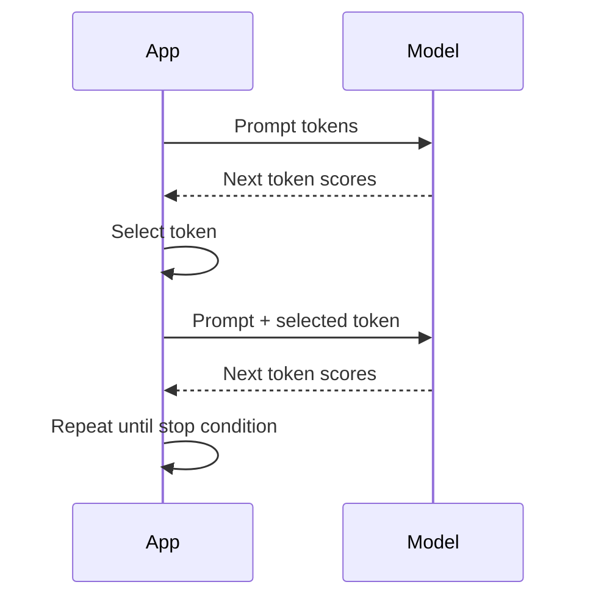

# 09. How LLMs Generate Text

An LLM generates text by repeatedly predicting the next token.

This simple sentence explains many production behaviors: streaming, latency, output limits, sampling, cost, and failure modes.

## Step-By-Step Generation

Suppose the prompt is:

```text
The capital of France is
```

The model calculates scores for many possible next tokens:

| Candidate Token | Informal Probability |
| --- | ---: |
| ` Paris` | High |
| ` Lyon` | Low |
| ` beautiful` | Low |
| `.` | Low |

If the selected token is ` Paris`, the sequence becomes:

```text
The capital of France is Paris
```

Then the model predicts the next token again.



In practice, optimized servers do not resend everything from scratch each time. They use KV cache. The mental model is still useful: generation is sequential.

## Stop Conditions

Generation stops when one of these happens:

- The model emits an end token.
- The server reaches the maximum output token limit.
- The user cancels the request.
- A safety or validation rule stops the response.
- The server times out.

Always set a maximum output length. Without it, a model can generate more than expected and waste money.

## Streaming

Because tokens appear one at a time, the server can stream them to the client.

For a chat UI, streaming improves perceived responsiveness:

```text
0 ms      request sent
450 ms    first token received
900 ms    sentence visible
2,400 ms  full answer complete
```

Without streaming, the user waits for the full 2,400 ms before seeing anything.

## Running Example: SupportBot

User asks:

```text
How do I rotate an API key?
```

SupportBot may generate:

```text
Create a new API key, update your application to use it, verify traffic, and then revoke the old key.
```

If the product needs concise answers, set a lower output limit and instruct the model to answer briefly. If the product needs detailed troubleshooting, allow more output tokens.

## Implementation Notes

A production request should capture:

```json
{
  "model": "support-chat-model",
  "prompt_tokens": 1450,
  "max_output_tokens": 300,
  "temperature": 0.2,
  "stream": true
}
```

These settings explain both behavior and cost.

## Common Mistakes

- Forgetting that every output token adds latency.
- Letting users request unlimited output.
- Testing only short responses.
- Using high randomness for structured answers.
- Measuring total latency but not time to first token.

## Key Ideas

- LLMs generate one token at a time.
- Each generated token becomes part of the next step's context.
- Longer outputs usually mean higher latency and cost.
- Streaming improves user experience even when total latency is unchanged.

## Developer Checklist

- Set output token limits.
- Use streaming for long responses.
- Use lower randomness for structured or critical tasks.
- Benchmark both prompt length and output length.
- Log stop reason for each request.
