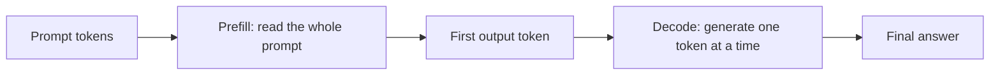
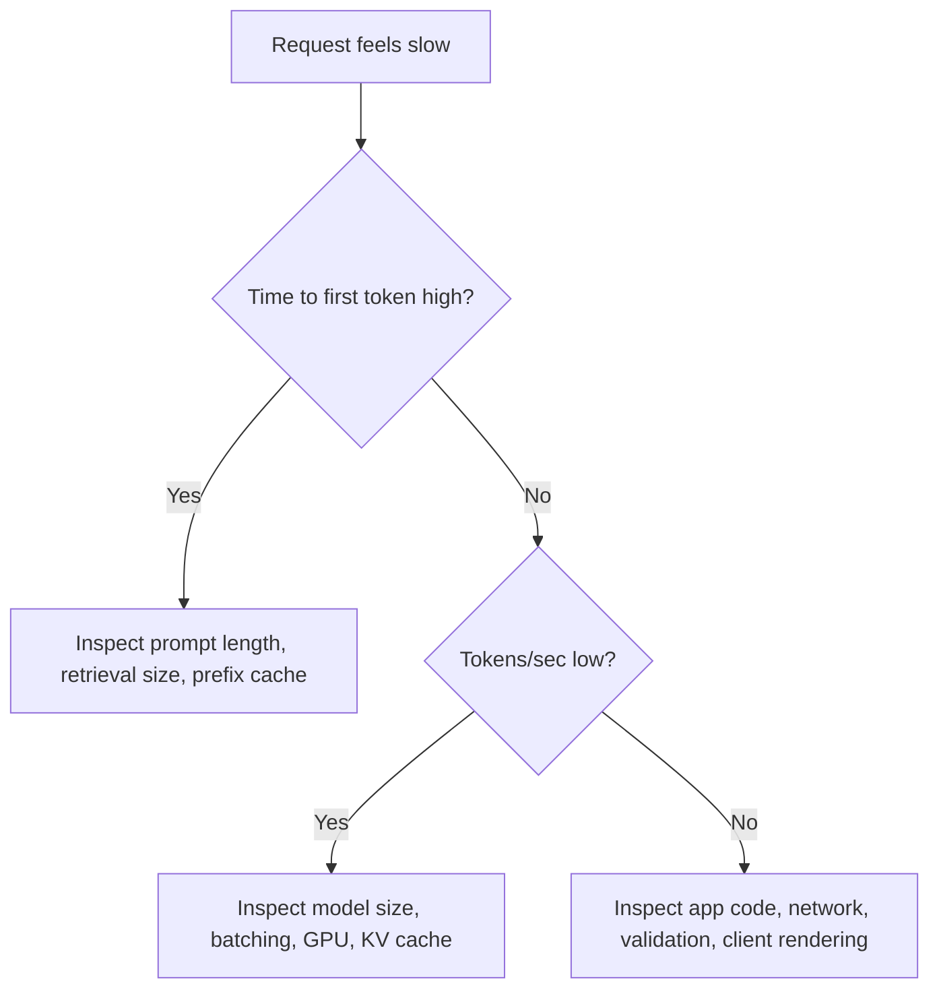

# 11. Prefill And Decode

LLM inference has two major phases: **prefill** and **decode**.

If you understand this split, latency charts and GPU behavior become much easier to reason about.

## The Two Phases

## Prefill

Prefill is the phase where the model processes the input prompt.

If the prompt has 2,000 tokens, the model must process those 2,000 tokens before it can generate the first output token. This includes system instructions, chat history, retrieved documents, tool results, and the user's message.

Prefill affects **time to first token**.

### Example

SupportBot receives:

| Prompt Component | Tokens |
| --- | ---: |
| System instruction | 80 |
| Conversation history | 500 |
| Retrieved documents | 1,800 |
| User question | 20 |
| Total input | 2,400 |

Even if the answer is short, the model must first read 2,400 input tokens.

## Decode

Decode is the phase where the model generates output tokens.

If the answer is 250 tokens, the model performs 250 sequential generation steps. This affects total response time and streaming speed.

Decode affects **tokens per second**.

## Why This Matters In Product Design

Two requests can have the same total token count but feel different:

| Request | Input Tokens | Output Tokens | User Experience |
| --- | ---: | ---: | --- |
| Long document summary | 8,000 | 200 | Slow first token, then short output |
| Creative writing | 200 | 2,000 | Fast first token, long streaming time |

The optimization strategy is different for each case.

## Debugging Flow

This flow prevents vague performance debugging. You first decide whether the problem is prefill, decode, or something outside the model server.

## Practical Tuning

To improve prefill:

- Reduce unnecessary retrieved context.
- Summarize old chat history.
- Reuse common prompt prefixes when supported.
- Avoid stuffing large documents into every request.

To improve decode:

- Set reasonable output limits.
- Use a model that is not larger than the task requires.
- Use an optimized serving engine.
- Measure batching behavior under concurrency.

## Common Mistakes

- Looking only at total latency.
- Assuming a long prompt is free because output is short.
- Assuming streaming solves slow prefill.
- Optimizing decode while retrieval is sending too much context.

## Key Ideas

- Prefill processes the input prompt.
- Decode generates output tokens.
- Long prompts hurt time to first token.
- Long answers hurt total latency and cost.

## Developer Checklist

- Measure time to first token separately from total latency.
- Track input tokens and output tokens for every request.
- Split latency dashboards into prefill-like and decode-like signals when possible.
- Reduce unnecessary context before buying more hardware.
- Use streaming when decode time is visible to users.
