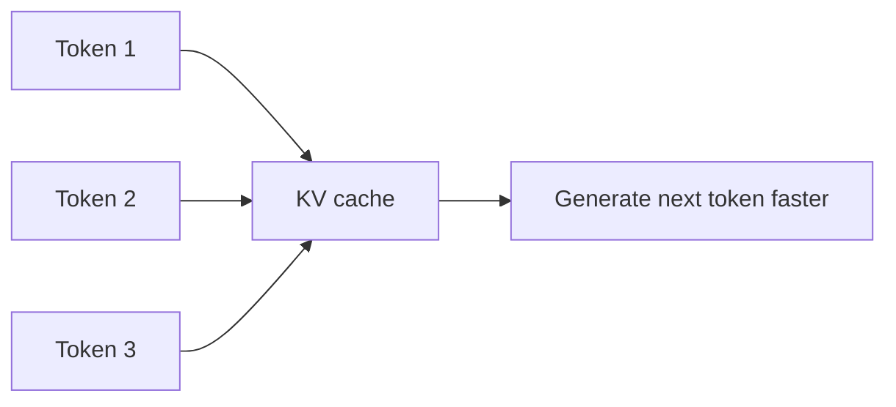
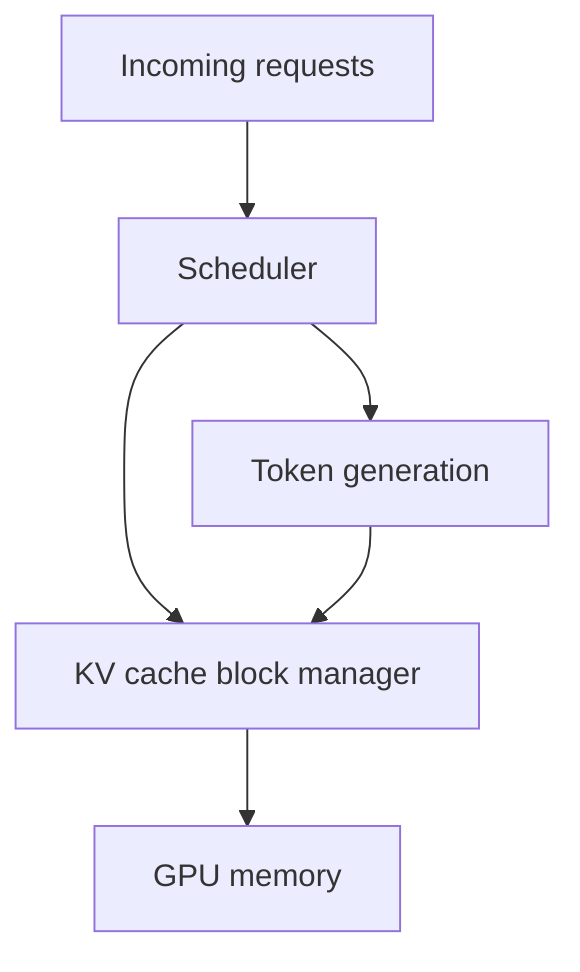

# 12. KV Cache

KV cache is a memory optimization used during transformer inference.

KV stands for **key** and **value**. These are internal tensors used by attention. You do not need to calculate them by hand, but you do need to understand their production impact: KV cache makes generation faster, but it consumes GPU memory.

## Why KV Cache Exists

During text generation, the model repeatedly needs information from previous tokens.

Without KV cache, the model would redo much more work for earlier tokens every time it generates a new token. With KV cache, the model stores reusable attention data.

## What Grows The Cache

KV cache grows with:

- More active requests
- Longer prompts
- Longer generated answers
- Larger models
- More transformer layers

This is why a model may load successfully but still fail under traffic. The weights fit, but the active request cache does not.

## Example: Memory Pressure

Imagine a GPU can run the model and has enough spare memory for 20 normal chat requests.

Then one user sends a request with:

- 30,000 input tokens
- 4,000 requested output tokens

That one request may consume much more KV cache than many normal requests. If the server does not enforce limits, other users can be slowed down or rejected.

## Serving Engine Responsibility

LLM serving engines manage KV cache carefully. They may:

- Allocate cache blocks.
- Reuse freed blocks.
- Batch requests with different sequence lengths.
- Evict or reject requests when memory is exhausted.
- Support prefix cache for repeated prompt prefixes.

## Running Example: SupportBot

SupportBot uses the same system instruction for every request. If the serving engine supports prefix caching, it may reuse the computation for that repeated instruction.

However, retrieved documents are different for each user question. Those tokens usually create request-specific KV cache.

## Common Mistakes

- Checking only model weight size when choosing a GPU.
- Allowing unlimited context length.
- Ignoring the memory effect of concurrent users.
- Testing one request at a time and assuming production will behave the same.

## Key Ideas

- KV cache stores attention data from previous tokens.
- It speeds up generation.
- It consumes GPU memory.
- Long contexts and many users increase cache pressure.

## Developer Checklist

- Monitor GPU memory during real traffic.
- Account for KV cache, not only model weights.
- Limit maximum context and output length.
- Test with concurrent requests and long prompts.
- Use serving engines with strong cache management.
