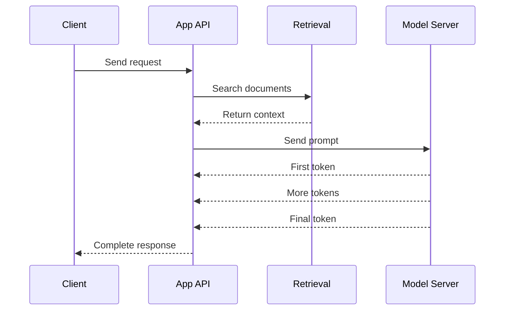
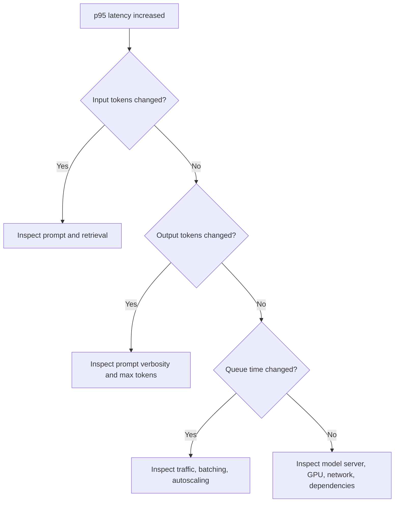

# 14. Performance Metrics

Inference systems need clear metrics. Without metrics, every optimization discussion becomes guesswork.

A useful dashboard must show speed, throughput, cost, quality, and reliability together. Optimizing only one of them can damage the others.

## Request Timeline



Useful metrics come from each part of this timeline.

## Core Metrics

| Metric | Meaning | Why It Matters |
| --- | --- | --- |
| Time to first token | Delay before output starts | User-perceived responsiveness |
| End-to-end latency | Full request duration | Overall user experience |
| Input tokens | Tokens sent to model | Prefill cost and memory |
| Output tokens | Tokens generated | Decode latency and cost |
| Tokens per second | Decode speed | Generation performance |
| Requests per second | Request throughput | Capacity planning |
| Queue time | Time waiting before execution | Saturation signal |
| Error rate | Failed requests | Reliability |
| Cost per request | Money spent per request | Business viability |
| Task success | Whether the user goal was met | Product quality |

## Percentiles

Average latency is not enough. Users experience individual requests, not averages.

If p99 latency is high, 1 out of 100 requests may feel bad even when the average looks fine.

Track:

- p50: typical request
- p95: slow but common enough to matter
- p99: tail behavior and outliers

## Example Dashboard For SupportBot

| Panel | Example Question |
| --- | --- |
| p95 time to first token | Are users waiting too long before text appears? |
| p95 total latency | Are long answers hurting completion time? |
| Input tokens by route | Which feature sends too much context? |
| Output tokens by route | Which prompts generate verbose answers? |
| Retrieval latency | Is search slowing the model path? |
| GPU memory | Are we near KV cache exhaustion? |
| Refusal rate | Is the bot saying "I do not know" too often? |
| Human rating | Are answers actually useful? |

## Debugging Example

Problem:

```text
p95 total latency increased from 3 seconds to 8 seconds.
```

Investigation:



This investigation uses metrics to narrow the problem instead of guessing.

## Quality Metrics

Speed is not enough. A fast wrong answer is still a bad product.

Quality signals may include:

- Human rating
- Exact match for extraction tasks
- JSON validation success
- Source citation accuracy
- Escalation rate to human support
- Repeat question rate
- Refund or complaint correlation

## Common Mistakes

- Reporting only average latency.
- Measuring model latency but ignoring retrieval and application time.
- Optimizing tokens per second while answer quality drops.
- Not separating input tokens from output tokens.
- Not logging prompt or model versions.

## Key Ideas

- Measure latency, throughput, cost, and quality together.
- Separate time to first token from total latency.
- Use percentiles, not only averages.
- Token metrics are required for inference engineering.

## Developer Checklist

- Add token metrics to every request.
- Track p50, p95, and p99 latency.
- Measure time to first token for streaming apps.
- Log model name, prompt version, sampling settings, and stop reason.
- Compare cost against task success, not only raw speed.
