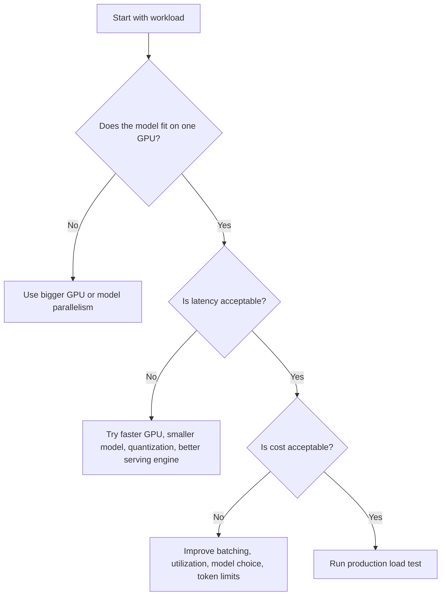

# 15. GPU Fundamentals

A GPU is a processor designed to run many numerical operations in parallel.

For inference engineering, the important question is not "What is the fastest GPU?" The important question is:

```text
Which hardware can serve this model, at this traffic level, with acceptable latency and cost?
```

## CPU vs GPU

A CPU is good at many different types of work: request handling, business logic, databases, operating system tasks, and orchestration.

A GPU is good at repeated numerical work over large blocks of data. Neural networks are mostly large numerical programs, so GPUs are usually much faster for deep learning inference.


The CPU still matters. The GPU runs the model, but the full product also needs CPU-side code for authentication, retrieval, validation, logging, and networking.

## The Three Hardware Limits

### 1. Memory Capacity

The model must fit in GPU memory. For LLMs, memory is used by:

- Model weights
- KV cache
- Temporary activations
- Runtime overhead

If the model weights fit but the KV cache does not, the server may still fail under concurrent traffic.

### 2. Memory Bandwidth

Memory bandwidth is how fast data can move inside the GPU.

LLM decode is often memory-bandwidth sensitive because the model repeatedly reads weights and cache while generating tokens.

### 3. Compute Throughput

Compute throughput is how many math operations the GPU can perform.

This matters for dense matrix operations, prefill, image models, speech models, and high-throughput workloads.

## NVIDIA Hardware Families In Practice

NVIDIA hardware is not one single category. Different series are meant for different deployment shapes.

| Hardware Family | Typical Place | Inference Use |
| --- | --- | --- |
| GeForce RTX | Developer desktops, experiments | Local prototypes, small models, demos |
| RTX PRO | Workstations and professional servers | Developer workstations, visual AI, smaller enterprise inference |
| L4 | Data center and cloud servers | Efficient video, embedding, small/medium inference |
| L40S | Data center servers | Visual AI, graphics plus AI, medium inference |
| H100/H200 | Data center AI servers | High-throughput LLM inference and training |
| GB200/GB300 NVL systems | Rack-scale AI factories | Very large LLMs, reasoning systems, high traffic |
| Jetson Orin/Thor | Edge devices and robotics | Local inference near cameras, robots, and sensors |

This table is intentionally practical. A developer choosing hardware should start from the workload, not from marketing names.

## Real-World Example: SupportBot

SupportBot answers documentation questions for a SaaS product.

First prototype:

```text
Developer laptop or workstation GPU
One engineer tests prompts and retrieval locally.
Traffic: one user.
Goal: prove the workflow.
```

Internal beta:

```text
One cloud GPU instance, possibly L4/L40S/H100 depending on model size.
Traffic: employees and a few test customers.
Goal: measure token usage, latency, and answer quality.
```

Production:

```text
Multiple GPU workers behind an API.
Traffic: many concurrent users.
Goal: p95 latency, cost per answer, uptime, rollout safety.
```

Large enterprise version:

```text
Dedicated H100/H200 or newer Blackwell rack-scale systems.
Traffic: high concurrency, long context, multiple models.
Goal: high throughput and predictable cost at scale.
```

## Hardware Selection Flow



## Common Mistakes

- Choosing hardware only by peak FLOPS.
- Ignoring memory capacity and KV cache.
- Testing one request and assuming concurrent traffic will work.
- Buying a large GPU before reducing prompt waste.
- Using data center GPUs for workloads that an edge or smaller accelerator can handle.

## Key Ideas

- GPUs accelerate parallel numerical work.
- GPU memory is a hard deployment limit.
- Memory bandwidth often matters for LLM decoding.
- NVIDIA has different hardware families for desktop, workstation, data center, rack-scale, and edge use.

## Developer Checklist

- Check model weight memory and KV cache needs.
- Measure input tokens, output tokens, and concurrency.
- Benchmark on the target hardware class.
- Compare cost per successful task, not only tokens per second.
- Keep CPU-side bottlenecks visible in traces.
