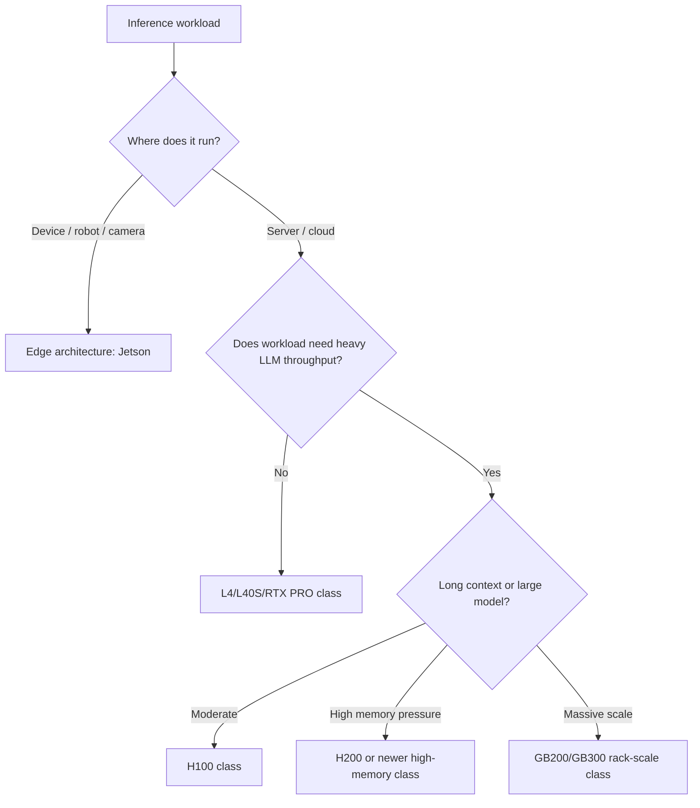

# 16. GPU Architecture

GPU architecture describes how a GPU is organized internally.

For inference engineering, you do not need to design a GPU. You need to understand which architecture features affect model serving.

## The Architecture Features That Matter

The most important features for inference are:

- GPU memory capacity
- Memory bandwidth
- Tensor cores
- Supported number formats
- Interconnect support
- Power and cooling
- Multi-instance or virtualization support
- Software support in CUDA, PyTorch, TensorRT, vLLM, and other runtimes

## Tensor Cores

Tensor cores are specialized GPU units for matrix math. Neural networks use matrix operations heavily, so tensor cores are central to AI performance.

Different GPU generations support different number formats.

| Format | Simple Meaning | Common Use |
| --- | --- | --- |
| FP32 | 32-bit floating point | High precision, less common for inference |
| TF32 | Tensor-friendly 32-bit style format | Training and some general acceleration |
| FP16 | 16-bit floating point | Common inference and training format |
| BF16 | 16-bit format with wider range | Common for training and inference |
| FP8 | 8-bit floating point | Optimized modern inference/training |
| INT8 | 8-bit integer | Quantized inference |
| FP4/INT4 | 4-bit formats | Aggressive inference optimization |

Lower precision can reduce memory and improve speed, but quality must be tested.

## Memory: Capacity vs Bandwidth

Memory capacity answers:

```text
Can the model and KV cache fit?
```

Memory bandwidth answers:

```text
How quickly can the GPU move model weights, activations, and cache data?
```

These are different. A GPU can have enough memory but still be slower than another GPU with higher bandwidth.

## NVIDIA Architecture Generations In Plain Language

This is a practical view for inference engineers.

| Architecture / Family | Common Products | Practical Meaning |
| --- | --- | --- |
| Ampere | A100, Jetson Orin | Strong previous-generation data center and edge AI foundation |
| Ada Lovelace | L4, L40S, RTX 40 class | Efficient inference, video, graphics, and professional visual AI |
| Hopper | H100, H200 | High-end data center AI with HBM memory and strong transformer performance |
| Blackwell | GB200, GB300, RTX PRO Blackwell | Newer generation focused on high-performance AI, lower precision formats, and rack-scale systems |
| Rubin / Vera Rubin | Next-generation rack-scale platforms | Designed for future large-scale reasoning and agentic AI systems |

The product name and architecture name are not the same thing. For example, H100 is a product based on Hopper. L40S is a product based on Ada Lovelace. GB200 is a Grace Blackwell platform.

## How Architecture Affects Real Workloads

### Small LLM Or Embedding Service

The workload may fit on L4 or L40S. You care about cost, power, enough memory, and good batching.

```text
Example: embedding 1 million support documents overnight and answering semantic search queries during the day.
```

### Large Chat Model

The workload may need H100 or H200. You care about HBM memory, bandwidth, tensor performance, and serving engine support.

```text
Example: serving a 70B model for customer support with thousands of daily users.
```

### Long-Context Model

Memory becomes more important because KV cache grows with context length and concurrency.

```text
Example: a legal assistant sends 40,000 tokens of retrieved case material and expects a 1,000-token answer.
```

H200-style larger memory can be more attractive than a smaller-memory GPU even if the model weights fit on both.

### Edge Vision System

Data center GPUs may be wrong. Jetson may be the right architecture because it runs near sensors with lower power.

```text
Example: a factory camera detects defects locally and sends only event metadata to the cloud.
```

## Architecture Decision Flow



## Power And Cooling

Inference cost is not only GPU rental or purchase price. Power and cooling matter.

Low-power GPUs such as L4 can be attractive for efficient high-throughput workloads. High-end GPUs such as H100/H200 or rack-scale Blackwell systems need serious data center power and cooling planning.

## Common Mistakes

- Comparing only peak FLOPS.
- Ignoring memory bandwidth.
- Assuming a newer architecture automatically improves your workload.
- Forgetting that software support may lag or vary by framework.
- Running edge workloads in the cloud when local inference would be cheaper or more reliable.

## Key Ideas

- Architecture affects memory, bandwidth, precision, and interconnect.
- Tensor cores are central to AI inference performance.
- Product families map to deployment environments.
- Real benchmarks matter more than architecture names.

## Developer Checklist

- Identify the GPU architecture and product, not just "NVIDIA GPU."
- Confirm supported precision formats for your model.
- Measure memory use with real prompt and output lengths.
- Check serving engine compatibility before deployment.
- Benchmark after changing architecture, precision, or model.
