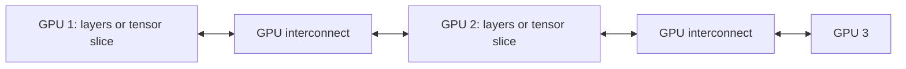
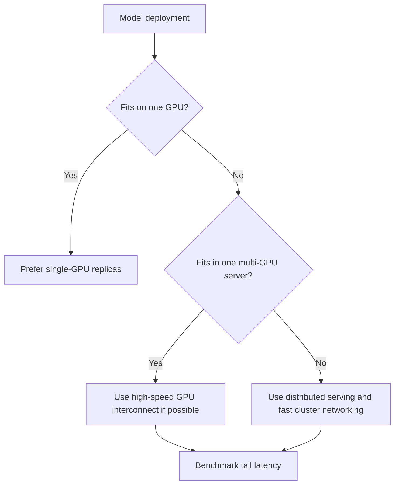

# 17. GPU Interconnects

An interconnect is the connection used to move data between CPUs, GPUs, and machines.

For small inference deployments, interconnects may not be the first thing you worry about. For large LLMs, they can become one of the main limits.

## Why Interconnects Matter

If a model fits on one GPU, the system can keep most model work inside that GPU.

If the model is split across GPUs, those GPUs must communicate during inference. Communication adds latency. The faster and lower-latency the interconnect, the better the chance that multi-GPU inference performs well.

## PCIe

PCIe is the common connection between CPUs and GPUs. It is widely used and works well for many single-GPU and modest multi-GPU deployments.

PCIe is usually enough when:

- Each request runs mostly on one GPU.
- The model is not split heavily across GPUs.
- The workload is not constantly moving large tensors between GPUs.

## NVLink And NVSwitch

NVLink is NVIDIA's high-speed GPU interconnect. NVSwitch allows many GPUs to communicate through a switched fabric.

These technologies matter when:

- The model is too large for one GPU.
- Tensor parallelism is used.
- A rack or server is designed to act like one large GPU pool.
- Long-context or high-throughput inference requires frequent communication.

## Rack-Scale Example

Large Blackwell systems such as GB200 NVL72 are designed around a large NVLink domain. Instead of thinking about one GPU card, the system is built as a rack-scale platform where many GPUs communicate as one larger inference machine.

That kind of system is not for a small chatbot. It is for massive models, heavy traffic, long context, reasoning workloads, or organizations running many AI services on shared infrastructure.

## Network Interconnects

At cluster scale, GPUs communicate across machines. The network then becomes part of inference performance.

Common concerns:

- Network bandwidth
- Network latency
- Cross-node traffic
- Placement of model shards
- Failure handling

## Real-World Example

SupportBot starts with one GPU per model replica. No advanced interconnect design is needed.

Later, the team wants to serve a very large model that does not fit on one GPU. They split it across eight GPUs. Now every request depends on GPU-to-GPU communication.

If those GPUs are connected only through slower paths, latency may be poor. If they are connected through a high-speed NVLink/NVSwitch design, the deployment has a better chance of meeting latency targets.

## Decision Flow

## Key Ideas

- Interconnects move data between CPUs, GPUs, and machines.
- Single-GPU serving is simpler when it meets requirements.
- Multi-GPU inference depends on communication speed.
- Rack-scale AI systems exist because very large models need high-bandwidth communication.

## Developer Checklist

- Prefer single-GPU serving when it meets requirements.
- Understand communication costs before splitting a model.
- Use high-speed interconnects for tensor-parallel inference.
- Benchmark multi-GPU setups with real traffic.
- Watch p95 and p99 latency, not only average throughput.
