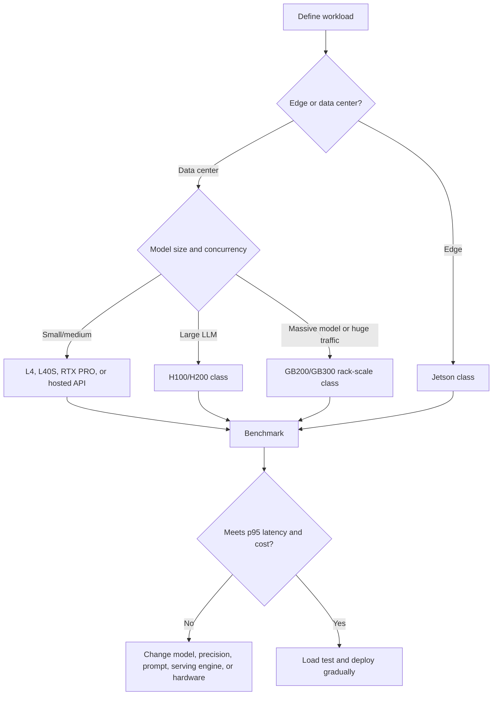

# 18. Hardware Selection

Hardware selection is the process of choosing machines for inference.

The wrong way to choose hardware is to ask, "What is the best GPU?" The right way is to ask:

```text
What is the cheapest reliable hardware that meets this workload's latency, throughput, memory, and quality requirements?
```

## Start With The Workload

Before choosing hardware, write down:

| Question | Example |
| --- | --- |
| What model are we serving? | 7B chat model, embedding model, VLM |
| How large is it? | 4-bit 7B, FP16 70B, multimodal model |
| Input length? | 500 tokens, 8,000 tokens, 100,000 tokens |
| Output length? | 100 tokens, 1,000 tokens |
| Concurrency? | 5 users, 500 users |
| Latency target? | p95 under 3 seconds |
| Deployment place? | Cloud, on-prem data center, robot, store, factory |
| Budget model? | Pay per request, reserved GPUs, owned hardware |

If you cannot answer these questions, you are not ready to choose hardware.

## NVIDIA Hardware Series Overview

This section gives practical categories, not every SKU.

| Series | Examples | Memory Shape | Best Fit | Avoid When |
| --- | --- | --- | --- | --- |
| GeForce RTX | RTX 4090, RTX 5090 class | High desktop VRAM, consumer platform | Local development, demos, experiments | You need data center reliability, vGPU, enterprise support, or predictable multi-tenant operations |
| RTX PRO | RTX PRO 6000 Blackwell, RTX PRO server/workstation cards | Professional GPU memory, workstation/server focus | AI development workstations, visual AI, smaller enterprise inference | You need maximum LLM throughput at data center scale |
| L-Series | L4, L40S | L4 is efficient and low-power; L40S has larger memory and visual AI capability | Cost-efficient inference, video pipelines, embeddings, smaller LLMs, VLM/image workloads | Very large LLMs or heavy tensor-parallel serving |
| H-Series | H100, H200 | High-bandwidth HBM memory, data center design | Serious LLM inference, fine-tuning, high-throughput production | Budget workloads that can run on smaller GPUs |
| Blackwell Rack-Scale | GB200 NVL72, GB300 NVL72 | Many GPUs connected as rack-scale systems | Trillion-parameter models, reasoning systems, huge traffic | Small teams, small models, low traffic |
| Jetson | Jetson Orin, Jetson Thor | Edge modules with integrated CPU/GPU memory | Robotics, cameras, factories, retail devices, offline edge AI | Centralized high-throughput web inference |

## Concrete NVIDIA Examples

### NVIDIA L4

L4 is a low-profile data center GPU often used for efficient inference, video, graphics, and general acceleration. It has 24GB GPU memory and a 72W thermal design power according to NVIDIA's published specifications.

Real-world use:

```text
A media company runs video transcription and moderation.
Each server has multiple L4 GPUs.
The workload combines video decode, ASR, small classification models, and some embedding inference.
The goal is low power and high throughput, not serving a giant LLM.
```

### NVIDIA L40S

L40S is a data center GPU with 48GB GDDR6 ECC memory. It is useful when the workload mixes AI with graphics, rendering, video, or visual computing.

Real-world use:

```text
A design platform offers AI image editing and 3D preview rendering.
L40S is attractive because the same GPU class can support visual workloads and model inference.
The team still benchmarks carefully because L40S is not the same class as H100/H200 for large LLM serving.
```

### NVIDIA H100

H100 is a data center GPU widely used for serious AI workloads. NVIDIA lists H100 SXM with 80GB GPU memory and H100 NVL with 94GB GPU memory, with high memory bandwidth and NVLink support.

Real-world use:

```text
A SaaS company self-hosts a 70B-class model for customer support and code assistance.
H100 GPUs provide enough memory and throughput for production traffic.
The team uses vLLM or another serving engine for batching and KV cache management.
```

### NVIDIA H200

H200 is similar in role to H100 but increases memory capacity. NVIDIA lists H200 with 141GB GPU memory and 4.8TB/s memory bandwidth.

Real-world use:

```text
A legal research product serves long-context prompts.
The model and KV cache need more memory than H100 comfortably provides.
H200 helps because long context and concurrent users increase memory pressure.
```

### NVIDIA RTX PRO 6000 Blackwell

RTX PRO 6000 Blackwell is a professional GPU family useful for workstations and some server workloads. NVIDIA describes the server edition as having 96GB GDDR7 memory and support for enterprise AI, physical AI, rendering, graphics, and video workloads.

Real-world use:

```text
An AI product team gives senior ML engineers workstation machines.
They use RTX PRO GPUs to prototype VLMs, run local inference, test quantization, and debug pipelines without waiting for shared cluster capacity.
```

### NVIDIA GB200 NVL72 / GB300 NVL72

GB200 NVL72 and GB300 NVL72 are rack-scale systems for very large AI workloads. NVIDIA describes GB200 NVL72 as connecting 36 Grace CPUs and 72 Blackwell GPUs in a liquid-cooled rack-scale design with a 72-GPU NVLink domain.

Real-world use:

```text
A frontier-model company serves large reasoning models with long context and high concurrency.
The model is too large and the traffic too heavy for simple single-server deployment.
The company uses rack-scale systems so many GPUs behave like one tightly connected inference platform.
```

### NVIDIA Jetson Orin

Jetson Orin is for edge AI. NVIDIA lists Jetson AGX Orin modules up to 275 TOPS and power configurable between 15W and 60W.

Real-world use:

```text
A warehouse robot detects pallets, reads labels, and makes navigation decisions locally.
Sending every camera frame to the cloud would add latency and depend on network availability.
Jetson runs vision inference on the robot itself.
```

## Decision Examples

### Example 1: Startup Chatbot

Workload:

- 7B or 13B model
- 500-token prompts
- 200-token answers
- Low early traffic

Reasonable path:

```text
Start with a hosted API or one modest cloud GPU.
Benchmark L4/L40S/H100 depending on model and latency needs.
Do not buy rack-scale hardware.
```

### Example 2: Long-Context Enterprise Search

Workload:

- 70B model
- 20,000-token prompts
- Many concurrent users
- Strict p95 latency

Reasonable path:

```text
Benchmark H100 vs H200.
Pay close attention to KV cache memory.
Use prompt trimming, retrieval limits, and prefix caching before scaling blindly.
```

### Example 3: Retail Store Camera AI

Workload:

- Multiple cameras
- Object detection and event recognition
- Must keep working if internet connection is weak

Reasonable path:

```text
Use Jetson edge devices in stores.
Send only events and summaries to the cloud.
Do not stream all video to a central LLM service unless required.
```

### Example 4: AI Image And Video Tool

Workload:

- Image generation
- Video processing
- Some LLM prompt assistance

Reasonable path:

```text
Evaluate L40S or RTX PRO server/workstation options.
If LLM traffic grows separately, split image/video workers from text-generation workers.
```

## Hardware Selection Flow



## What To Benchmark

Benchmark with realistic:

- Prompt length
- Output length
- Concurrency
- Sampling settings
- Quantization
- Retrieval context
- Streaming behavior
- Failure and retry patterns

## Common Mistakes

- Choosing H100/H200 because they are famous, not because the workload needs them.
- Choosing L4 because it is cheaper, then discovering the model or latency target does not fit.
- Ignoring edge devices for camera and robotics workloads.
- Assuming workstation GPUs behave like managed data center infrastructure.
- Forgetting that long context increases KV cache memory.

## Key Ideas

- Hardware choice starts with workload shape.
- NVIDIA hardware families target different deployment environments.
- Memory, bandwidth, interconnect, power, and software support all matter.
- Real benchmarks beat spec-sheet guesses.

## Developer Checklist

- Write the workload table before choosing hardware.
- Test at realistic concurrency.
- Measure p95 and p99 latency.
- Track GPU memory during long-context requests.
- Compare cost per successful task.
- Revisit hardware choice when model, prompt, or traffic changes.
