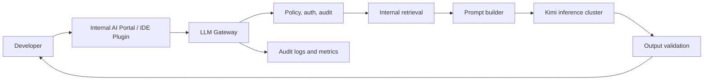

# 38. Bank On-Prem LLM Requirements

This production section uses one concrete case study.

A bank has 100 software developers. The bank wants an internal LLM assistant for daily engineering work:

- Code explanation
- Unit test generation
- SQL review
- Documentation search
- Secure coding help
- Incident summary drafts
- Internal API usage help
- Migration assistance

The bank cannot send prompts, code, logs, database schemas, incidents, or documents to a public cloud LLM service.

That single constraint changes the whole production design.

## Why Cloud LLM APIs Are Not Allowed

Banks usually have strict rules for:

- Customer data
- Internal source code
- Security findings
- Production logs
- Access tokens and secrets
- Network boundaries
- Audit evidence
- Vendor risk
- Data residency

Even if a cloud provider offers strong controls, this case study assumes the bank policy is:

```text
No developer prompt or internal document leaves bank-controlled infrastructure.
```

That means the bank needs an on-prem or private data center deployment.

## Workload Assumptions

We need assumptions before doing hardware math.

| Item | Assumption |
| --- | --- |
| Users | 100 developers |
| Peak active users | 20 concurrent developers |
| Heavy concurrent requests | 5 to 10 long-running generations |
| Typical prompt | 2,000 to 8,000 tokens |
| Heavy prompt | 32,000 to 128,000 tokens |
| Maximum context goal | 256,000 tokens if model supports it |
| Typical answer | 300 to 1,500 tokens |
| Peak use cases | codebase Q&A, incident analysis, secure coding review |
| Data location | bank data center |
| Availability target | internal critical service, not public customer-facing tier |

These assumptions matter more than the employee count. One developer pasting a large incident log can consume more resources than ten developers asking short questions.

## Model Assumption

The user asked for "Kimi K2.7". Public model references are often named differently than internal product names. For this chapter, we assume the bank wants to run the public Kimi K2 instruction model family on premise, specifically a Kimi K2 model with these planning properties:

| Property | Planning Value |
| --- | ---: |
| Architecture | Mixture of Experts |
| Total parameters | About 1 trillion |
| Active parameters per token | About 32 billion |
| Context length | Up to 256K tokens |
| Practical serving precision | FP8 for serious deployment |

The most important point: **MoE active parameters reduce compute per token, but the full model weights still need to be stored across the serving system.**

## User-Facing Product Shape

The bank should not expose a raw model endpoint directly to developers.

The product should look like this:



The model is only one component. The gateway is where the bank enforces security, logging, rate limits, routing, and policy.

## Required Capabilities

The bank needs:

- Private model serving
- Internal identity integration
- Role-based access to documents
- Prompt and response audit logs
- Secret redaction
- Rate limits per user and team
- Model and prompt versioning
- Retrieval over internal documentation and code
- Offline evaluation set
- Incident response process
- Capacity dashboard

Without these, the system is a demo, not a bank production service.

## What Not To Build First

Do not start by writing Kubernetes YAML.

Start with:

1. Which model?
2. Which data can it access?
3. What latency is acceptable?
4. What prompts are forbidden?
5. What answer quality is required?
6. What hardware can fit the model?
7. What is the rollout plan for 100 developers?

Docker and Kubernetes are packaging and orchestration tools. They are not the architecture.

## Key Ideas

- On-prem LLM serving starts from security and workload requirements.
- A bank needs a gateway, audit layer, retrieval system, and policy controls.
- The model endpoint should not be exposed directly.
- Hardware math depends on model size, precision, context length, and concurrency.

