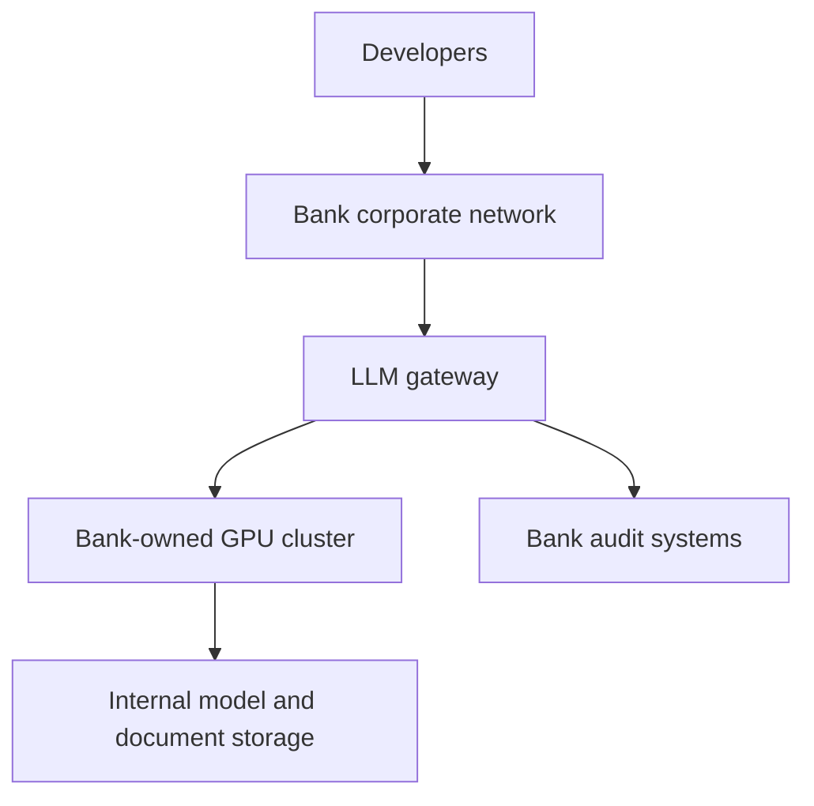
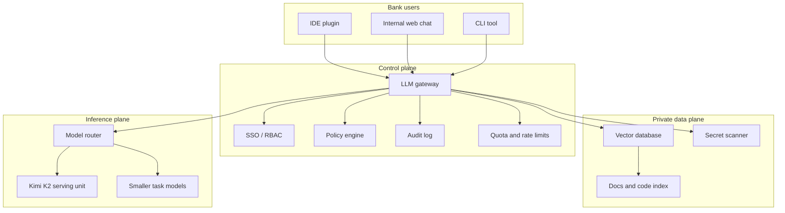

# 39. On-Prem Deployment Options

The bank has several ways to run an internal LLM without using a public cloud API.

There is no single correct option. The right choice depends on security rules, budget, latency, model size, and operational maturity.

## Option 1: Buy And Operate A GPU Cluster

The bank owns the servers and runs them in its data center.



### Advantages

- Strongest control over data location
- Easier to satisfy strict internal policy
- No prompt data leaves the bank
- Can integrate with internal security monitoring

### Disadvantages

- High upfront cost
- Needs GPU operations skill
- Capacity planning is the bank's responsibility
- Hardware procurement can be slow

This is the most likely option for the case study.

## Option 2: Private Cloud Inside Bank Data Center

The bank runs a private cloud platform internally. The LLM cluster is one managed service inside that platform.

This can work well if the bank already has internal platform engineering.

### Advantages

- Better self-service for teams
- Standardized deployment process
- Easier chargeback and quota management

### Disadvantages

- Still needs physical GPU capacity
- Platform complexity can hide performance problems
- Generic private cloud teams may not understand LLM serving details

## Option 3: Vendor Appliance

The bank buys a pre-integrated AI appliance from a hardware or infrastructure vendor.

### Advantages

- Faster initial setup
- Vendor support
- Validated hardware/software stack

### Disadvantages

- Expensive
- Less flexibility
- Vendor lock-in
- Still needs bank-side security integration

This can be reasonable if the bank lacks GPU platform expertise.

## Option 4: Smaller On-Prem Models First

Instead of starting with Kimi K2, the bank can begin with smaller models for some workflows:

- Code completion
- Code explanation
- Documentation search
- Classification
- Summarization

### Advantages

- Cheaper
- Faster to deploy
- Easier to evaluate
- Lower operational risk

### Disadvantages

- May not match Kimi K2 quality
- May need task routing across multiple models
- Developers may be disappointed if expectations were set by larger public models

## Recommended Path For The Bank

For a bank with 100 developers:

```text
Phase 1: Deploy gateway, retrieval, audit, and a smaller model.
Phase 2: Run Kimi K2 benchmark on real internal tasks.
Phase 3: Buy enough hardware for one production Kimi K2 serving unit.
Phase 4: Roll out to 20 developers.
Phase 5: Expand to all 100 developers if utilization and quality justify cost.
```

Do not buy a large cluster before measuring real developer behavior.

## Reference Architecture



## Key Ideas

- On-prem does not mean one server under a desk.
- The bank needs a controlled internal AI platform.
- A smaller model rollout can reduce risk before buying Kimi-scale hardware.
- The gateway is the enforcement point for security and cost.

