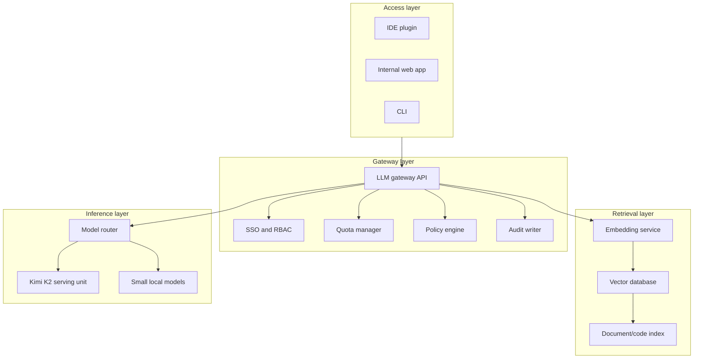
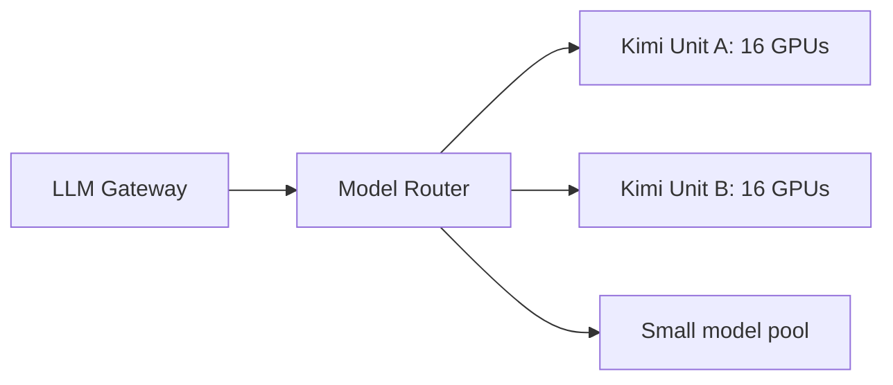

# 41. Hosting And Deployment Plan

This chapter explains how the bank should host the system.

This is not a generic Docker chapter. Containers may still be used, but the real deployment design is about isolation, routing, data flow, hardware, and operations.

## Deployment Layers



## Physical Placement

The Kimi serving unit should run in a restricted data center zone.

Recommended zones:

| Zone | Contains |
| --- | --- |
| User zone | Developer laptops, IDE plugins |
| App zone | Gateway, web app, API |
| Data zone | indexes, document stores, audit logs |
| GPU zone | inference servers |
| Admin zone | monitoring, deployment, model artifact control |

Only the gateway should talk to the model servers. Developer machines should not call the inference cluster directly.

## Serving Stack

The bank should select a serving engine that explicitly supports the Kimi K2 model release.

Candidate serving engines may include:

- vLLM when the model release is supported
- SGLang when structured generation or model support is better
- Vendor-provided deployment stack if required
- TensorRT-LLM only if the model path is validated for that exact release

The bank should not assume every serving engine supports every MoE model correctly.

## Deployment Units

Use the term **serving unit**:

```text
One Kimi K2 serving unit = enough GPU servers to load one sharded model instance.
```

For this case:

```text
One serving unit = about 16 x H200-class GPUs.
```

A request router sends traffic to available serving units.



## Rollout Plan

### Phase 0: Lab Validation

Goal:

```text
Can the model load, generate, and pass basic internal tests?
```

Tasks:

- Load model weights from internal storage.
- Run simple prompts.
- Measure memory usage.
- Validate context length.
- Confirm tokenizer and stop behavior.

### Phase 1: Security Wrapper

Goal:

```text
No one uses the raw model endpoint.
```

Tasks:

- Build gateway.
- Add SSO.
- Add per-user audit.
- Add rate limits.
- Add prompt size limits.
- Add secret scanning.

### Phase 2: 20-Developer Pilot

Goal:

```text
Measure real developer behavior.
```

Tasks:

- Enable IDE plugin and web UI for 20 developers.
- Track task types.
- Track token usage.
- Collect feedback.
- Tune context limits.

### Phase 3: 100-Developer Rollout

Goal:

```text
Serve all developers without cluster overload.
```

Tasks:

- Add model routing.
- Add smaller models for simple tasks.
- Add queueing policies.
- Add team quotas.
- Add HA if usage justifies it.

## Context And Rate Limits

Recommended initial limits:

| Control | Starting Value |
| --- | ---: |
| Default context | 16K tokens |
| Default output | 1K tokens |
| Extended context | 32K tokens |
| Heavy context | approval or quota |
| Max concurrent heavy jobs per user | 1 |
| Max concurrent Kimi jobs per team | based on pilot data |

## Deployment Checklist

- Model weights stored in internal artifact repository
- Checksums verified before deployment
- Serving engine version pinned
- GPU driver and CUDA stack documented
- Gateway blocks direct model access
- Prompt and output logging policy approved
- Redaction tested
- Evaluation set created
- Rollback plan tested
- Capacity dashboard available before rollout

## Key Ideas

- Hosting is about controlled access and safe data flow.
- Containers can package services, but they are not the design.
- One Kimi deployment unit is a large multi-GPU system.
- The bank should roll out by measured phases, not all at once.

