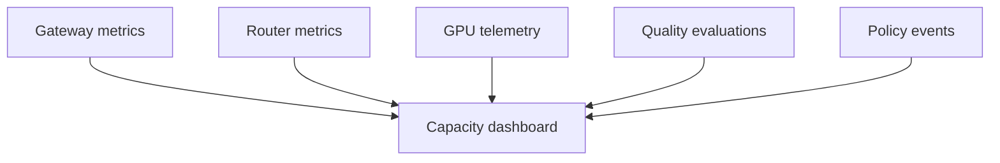
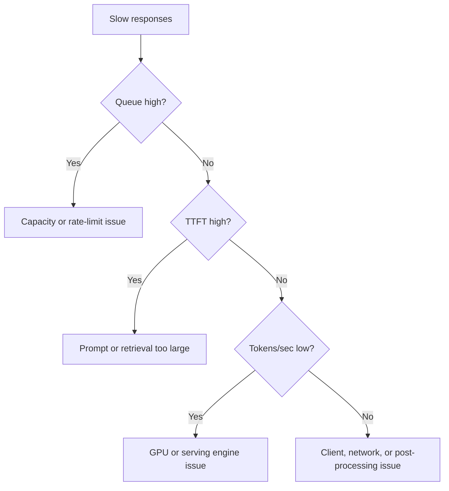

# 43. Operating The On-Prem LLM

After deployment, the bank must operate the LLM like critical internal infrastructure.

The team needs monitoring, incident response, upgrades, capacity planning, and user support.

## What To Monitor

| Metric | Why It Matters |
| --- | --- |
| Time to first token | Prefill and queue responsiveness |
| Total latency | User experience |
| Input tokens | Context cost |
| Output tokens | Decode cost |
| Queue length | Saturation |
| GPU memory used | KV cache and model pressure |
| GPU utilization | Capacity and waste |
| Tokens per second | Decode health |
| Request failures | Reliability |
| Refusals | Policy or retrieval issues |
| User rating | Product quality |

## Capacity Dashboard



The dashboard should answer:

- Are users waiting in queue?
- Are long-context requests consuming the cluster?
- Is GPU memory close to exhaustion?
- Are we serving simple tasks with an expensive model?
- Did answer quality drop after a change?

## Incident Examples

### Incident 1: Developers Report Slow Responses

Investigation:



### Incident 2: Model Gives Unauthorized Answer

Investigation:

1. Find request ID.
2. Check user identity.
3. Check retrieved document IDs.
4. Check document permissions.
5. Check prompt template version.
6. Check output validation decision.
7. File security incident if permission filter failed.

### Incident 3: GPU Memory Exhaustion

Likely causes:

- Too many concurrent long-context requests
- Output limit too high
- Serving engine memory fragmentation
- Model reload issue
- Bad rollout increasing context size

Immediate mitigation:

- Reduce max context temporarily.
- Reduce max output tokens.
- Pause heavy jobs.
- Route simple tasks to smaller models.
- Restart affected serving unit only if needed.

## Upgrade Process

Model upgrades are risky because they can change:

- Answer style
- Tool behavior
- Token usage
- Latency
- Refusal behavior
- Security behavior

Use this rollout:

```text
offline eval -> shadow traffic -> pilot users -> canary -> full rollout
```

Do not replace the model for all 100 developers in one step.

## Support Model

The bank should assign ownership:

| Area | Owner |
| --- | --- |
| GPU cluster | Infrastructure/platform team |
| Serving engine | AI platform team |
| Gateway | Application platform team |
| Security policy | Security architecture |
| Evaluations | Developer productivity or AI enablement team |
| User support | Internal developer tools team |

## Key Ideas

- On-prem LLMs need operations, not just installation.
- Capacity must be managed with context limits and quotas.
- Model upgrades need evaluation and staged rollout.
- Incidents need request IDs and audit trails.

