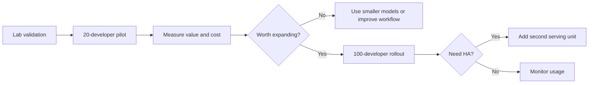

# 44. Cost, Capacity, And Rollout Decision

Kimi K2-class on-prem deployment is expensive. The bank should treat it as a platform investment, not a side project.

The decision should be based on measured developer value.

## Cost Categories

| Category | Examples |
| --- | --- |
| GPUs | H200-class servers or newer |
| CPU servers | Gateway, retrieval, vector DB, monitoring |
| Storage | Model weights, document indexes, audit logs |
| Networking | High-speed interconnect and data center network |
| Power and cooling | Especially for dense GPU systems |
| Staff | Platform engineers, security, SRE |
| Vendor support | Hardware and software support contracts |
| Evaluation | Test sets, human review, quality measurement |

## Capacity Planning For 100 Developers

Start with realistic tiers:

| Deployment | GPUs | Use |
| --- | ---: | --- |
| Lab only | 16 x H200-class | Validate model and serving stack |
| Controlled pilot | 16 x H200-class | 20 developers with quotas |
| Production no full HA | 16 x H200-class + smaller model pool | 100 developers, limited heavy context |
| Production with HA | 32 x H200-class + smaller model pool | 100 developers with maintenance/failure tolerance |
| Growth | 48+ GPUs | More teams, more long-context usage, higher concurrency |

The bank should not promise unlimited 256K context to every developer. That is how an internal tool becomes unstable and expensive.

## Rollout Policy

Recommended rollout:



## Success Metrics

The bank should measure:

- Developer time saved
- Pull request cycle time
- Incident summary quality
- Secure coding issue reduction
- Documentation search success
- User satisfaction
- Cost per active developer
- Cost per successful task

Do not measure only token throughput. The goal is developer productivity under bank security constraints.

## When Kimi K2 Is Worth It

Kimi K2-class serving may be worth it when:

- The bank has strict no-cloud rules.
- Developers work with sensitive internal code and documents.
- Smaller models fail on important reasoning tasks.
- The bank can keep the cluster used enough to justify cost.
- The platform team can operate GPU infrastructure safely.

## When It Is Not Worth It

It may not be worth it when:

- Usage is light.
- Most tasks are simple.
- Smaller local models perform well enough.
- The organization lacks GPU operations skill.
- Procurement and support costs exceed productivity gains.

## Final Recommendation

For this bank:

```text
Do not start with full 100-developer unrestricted Kimi K2 access.
```

Start with:

1. Internal LLM gateway.
2. Permission-aware retrieval.
3. Smaller local models for simple tasks.
4. One Kimi K2 serving unit for complex tasks.
5. Strict context limits and quotas.
6. A 20-developer pilot.
7. Expansion only after measuring value.

If the pilot proves value and the bank needs reliability, move to:

```text
Two Kimi K2 serving units = roughly 32 x H200-class GPUs.
```

## Key Ideas

- Hardware is only justified by measured developer value.
- One Kimi K2 serving unit is the starting point, not the final platform.
- High availability roughly doubles the GPU requirement.
- Smaller models and routing are essential for cost control.
- Context policy is capacity policy.

