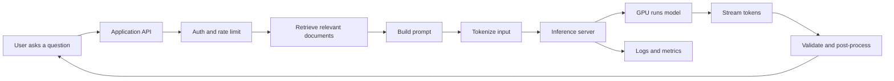

# Inference Engineering Handbook

This book is for software developers who are new to AI and want to understand how AI models are served in real products.

Most beginner AI material focuses on training models. Inference engineering is different. It is about taking a trained model and making it answer users reliably, quickly, safely, and at a cost the business can afford.

You do not need machine learning experience to read this book. The chapters explain terms from the ground up and use software engineering language wherever possible.

## Running Example Used Throughout The Book

The book follows one practical product idea: **SupportBot**, an AI assistant that answers customer questions from a company's documentation.

SupportBot is useful because it touches almost every inference engineering topic:

- It receives user questions through an API.
- It searches company documents using embeddings.
- It builds prompts for an LLM.
- It streams answers back to users.
- It logs latency, token usage, quality signals, and errors.
- It must be fast, reliable, safe, and affordable.

The full request flow looks like this:

By the end of the book, you should be able to explain each box in that diagram and know what can go wrong inside it.

## How To Read This Book

Read the book in order if you are new to AI. Later chapters depend on the vocabulary from earlier chapters.

If you are already a developer working near production systems, pay special attention to:

- Part 2: Inference
- Part 4: Software
- Part 5: Optimization
- Part 7: Production

Each chapter now uses this structure:

- Plain-language explanation
- Concrete example
- Diagram or flow where useful
- Production notes
- Common mistakes
- Developer checklist

## Book Structure

### Part 1: AI Foundations

This part explains the basic ideas behind AI, machine learning, deep learning, neural networks, transformers, large language models, and common terminology.

- [01. What Is Artificial Intelligence?](Part-1-AI-Foundations/01-What-is-Artificial-Intelligence.md)
- [02. Machine Learning](Part-1-AI-Foundations/02-Machine-Learning.md)
- [03. Deep Learning](Part-1-AI-Foundations/03-Deep-Learning.md)
- [04. Neural Networks](Part-1-AI-Foundations/04-Neural-Networks.md)
- [05. Transformers](Part-1-AI-Foundations/05-Transformers.md)
- [06. Large Language Models](Part-1-AI-Foundations/06-Large-Language-Models.md)
- [07. AI Terminology](Part-1-AI-Foundations/07-AI-Terminology.md)

### Part 2: Inference

This part explains what happens when a model receives a request and generates an answer.

- [08. Training vs Inference](Part-2-Inference/08-Training-vs-Inference.md)
- [09. How LLMs Generate Text](Part-2-Inference/09-How-LLMs-Generate-Text.md)
- [10. Tokenization](Part-2-Inference/10-Tokenization.md)
- [11. Prefill And Decode](Part-2-Inference/11-Prefill-and-Decode.md)
- [12. KV Cache](Part-2-Inference/12-KV-Cache.md)
- [13. Sampling](Part-2-Inference/13-Sampling.md)
- [14. Performance Metrics](Part-2-Inference/14-Performance-Metrics.md)

### Part 3: Hardware

This part explains GPUs and the hardware choices that affect inference speed, cost, and reliability.

- [15. GPU Fundamentals](Part-3-Hardware/15-GPU-Fundamentals.md)
- [16. GPU Architecture](Part-3-Hardware/16-GPU-Architecture.md)
- [17. GPU Interconnects](Part-3-Hardware/17-GPU-Interconnects.md)
- [18. Hardware Selection](Part-3-Hardware/18-Hardware-Selection.md)

### Part 4: Software

This part introduces the software stack commonly used to run models efficiently.

- [19. CUDA](Part-4-Software/19-CUDA.md)
- [20. PyTorch](Part-4-Software/20-PyTorch.md)
- [21. ONNX](Part-4-Software/21-ONNX.md)
- [22. vLLM](Part-4-Software/22-vLLM.md)
- [23. SGLang](Part-4-Software/23-SGLang.md)
- [24. TensorRT-LLM](Part-4-Software/24-TensorRT-LLM.md)
- [25. Benchmarking](Part-4-Software/25-Benchmarking.md)

### Part 5: Optimization

This part explains techniques used to make inference faster, cheaper, and more scalable.

- [26. Quantization](Part-5-Optimization/26-Quantization.md)
- [27. Speculative Decoding](Part-5-Optimization/27-Speculative-Decoding.md)
- [28. KV Caching](Part-5-Optimization/28-KV-Caching.md)
- [29. Model Parallelism](Part-5-Optimization/29-Model-Parallelism.md)
- [30. Disaggregation](Part-5-Optimization/30-Disaggregation.md)
- [31. Attention Optimizations](Part-5-Optimization/31-Attention-Optimizations.md)

### Part 6: Modalities

This part explains text, vision, speech, image, and video systems from an inference point of view.

- [32. VLMs](Part-6-Modalities/32-VLMs.md)
- [33. Embeddings](Part-6-Modalities/33-Embeddings.md)
- [34. ASR](Part-6-Modalities/34-ASR.md)
- [35. TTS](Part-6-Modalities/35-TTS.md)
- [36. Image Generation](Part-6-Modalities/36-Image-Generation.md)
- [37. Video Generation](Part-6-Modalities/37-Video-Generation.md)

### Part 7: Production

This part uses one realistic case study: a bank with 100 developers wants an on-prem LLM assistant for daily engineering work and cannot send prompts or code to a public cloud provider.

- [38. Bank On-Prem LLM Requirements](Part-7-Production/38-Bank-On-Prem-LLM-Requirements.md)
- [39. On-Prem Deployment Options](Part-7-Production/39-On-Prem-Deployment-Options.md)
- [40. Kimi K2 Sizing Math](Part-7-Production/40-Kimi-K2-Sizing-Math.md)
- [41. Hosting And Deployment Plan](Part-7-Production/41-Hosting-And-Deployment-Plan.md)
- [42. Security, Governance, And Audit](Part-7-Production/42-Security-Governance-And-Audit.md)
- [43. Operating The On-Prem LLM](Part-7-Production/43-Operating-The-On-Prem-LLM.md)
- [44. Cost, Capacity, And Rollout Decision](Part-7-Production/44-Cost-Capacity-And-Rollout-Decision.md)

### Appendix

- [Cheat Sheets](Appendix/Cheat-Sheets.md)
- [Interview Questions](Appendix/Interview-Questions.md)
- [Glossary](Appendix/Glossary.md)
- [Further Reading](Appendix/Further-Reading.md)
- [End-To-End Case Study](Appendix/End-To-End-Case-Study.md)

## Main Idea

Inference engineering is the discipline of making trained AI models useful in production.

It combines:

- Software engineering
- Distributed systems
- Hardware awareness
- Model behavior understanding
- Performance measurement
- Production operations

The goal is not only to make a model work. The goal is to make it work for real users under real traffic, real latency targets, real budgets, and real failure conditions.
